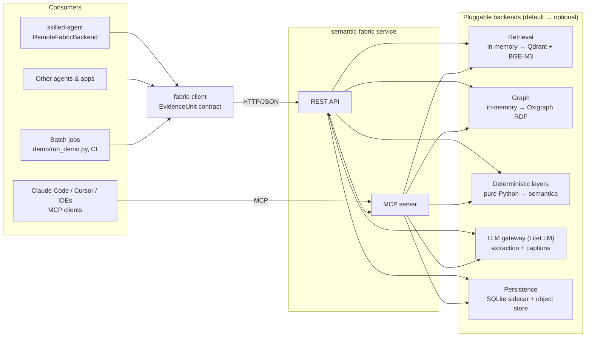
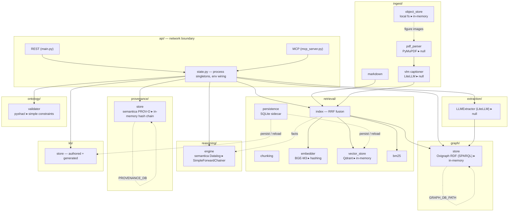
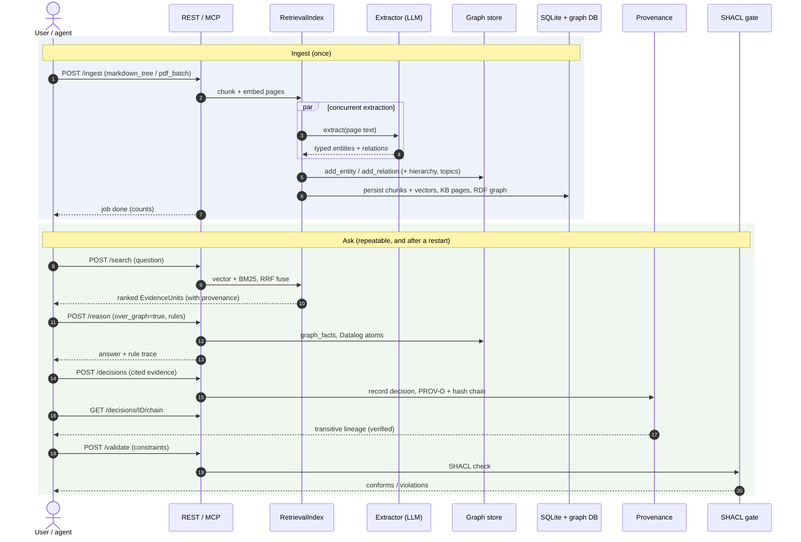

# semantic-fabric

An enterprise **knowledge, context & semantic layer** — the machine-scale half of a
two-repo design. It ingests both curated Markdown and dense heterogeneous data
(PDFs with charts and tables) into one auditable Context Graph, and serves retrieval,
reasoning, and provenance to agents over **REST + MCP**.

Its companion front-end, [`skilled-agent`](https://github.com/a-romero/skilled-agent),
stays lean and **semantica-free** — it talks to this service only through the
lightweight [`fabric-client`](client/) package.

> **Status: end-to-end and durable.** Real and wired: multi-format ingestion
> (Markdown **and** real PDF layout parsing → text/tables/figures, with LLM figure
> captioning), hybrid retrieval (`/search`, vector + BM25, RRF-fused), GraphRAG
> (`/graph/expand` + a whole-graph snapshot at `/graph`), LLM knowledge extraction
> (`/extract`, provider-agnostic) wired into ingest to build the graph, **reasoning over
> the knowledge graph** (`/reason` with `over_graph`), provenance + lineage
> (`/decisions`, W3C PROV-O, tamper-evident chain, `/decisions/{id}/chain`), and the
> SHACL policy gate (`/validate`). Everything runs on **pure-Python defaults** out of the
> box; optional extras swap in the real backends (Qdrant + BGE-M3, semantica PROV-O /
> Datalog / SHACL, LiteLLM extraction + vision captioning, PyMuPDF, and a persistent
> SPARQL-native Oxigraph graph). With `FABRIC_DB` + `GRAPH_STORE=rdf` the full state —
> retrieval index, KB, knowledge graph, and decision lineage — **survives restarts**.
>
> A one-command demo ingests a directory and produces a visual capability report — see
> **[`demo/RUNBOOK.md`](demo/RUNBOOK.md)**.

---

## 1. How consumers integrate (high level)

`skilled-agent`, IDE/agent MCP clients, and batch jobs all talk to the same service
through one contract — the **`EvidenceUnit`** — and fall back to their own local search
when the fabric is unreachable, so the layer is an *upgrade, not a prerequisite*.



- The wire payload is the **`EvidenceUnit`** — `{content, type, score, provenance,
  entities}` plus a backward-compatible `{path, title, summary}` trio — single-sourced in
  [`client/fabric_client/models.py`](client/fabric_client/models.py).
- REST and MCP expose the **same** capabilities, so an HTTP app and an MCP-native agent
  see identical behaviour.

---

## 2. Component architecture (detailed)

Every capability sits behind an interface with a **dependency-free default** and an
**optional real backend**, selected by an environment variable. CI runs the defaults;
the real backends are validated on a capable host (`scripts/validate.sh`).



Module map:

```
contracts/     OpenAPI + EvidenceUnit JSON-Schema snapshot (the boundary)
client/        fabric-client: contract types + HTTP client (published; semantica-free)
api/           REST (main.py) + MCP (mcp_server.py) + state.py wiring
ingest/        markdown, pdf_parser (PyMuPDF), vlm captioner, object_store
extraction/    provider-agnostic LLM entity/relation extractor (LiteLLM)
retrieval/     embedder · vector_store · bm25 · index (RRF) · persistence (SQLite)
graph/         Context Graph — in-memory + persistent SPARQL-native Oxigraph (RDF)
reasoning/     deterministic inference — SimpleForwardChainer + semantica Datalog
provenance/    PROV-O lineage + decisions (in-memory chain + semantica)
ontology/      SHACL / declarative constraint gate
kb/            authored + generated Markdown namespaces
demo/          run_demo.py end-to-end driver + RUNBOOK + sample corpus
scripts/       validate.sh (on-env checks) + semantica introspection
tests/         defaults suite (CI) + opt-in on-env suites
```

---

## 3. End-to-end flow (low level)

One pass through the platform — ingest a corpus, then ask a question — showing the
component interactions. LLM extraction during ingest runs **concurrently**
(`EXTRACTION_CONCURRENCY`), and the graph mutations are applied on one thread so ordering
stays deterministic.



The demo driver ([`demo/run_demo.py`](demo/run_demo.py)) automates exactly this and
renders it as a self-contained HTML report (corpus tiles, KB hierarchy, a knowledge-graph
diagram, and the question → answer panel with evidence, reasoning, PROV-O lineage and the
SHACL result). See **[`demo/RUNBOOK.md`](demo/RUNBOOK.md)**.

---

## 4. Two KB namespaces

- **`authored/`** — human-curated Markdown, **pushed to `POST /ingest`** from anywhere.
  Authoritative; the fabric ingests but never overwrites it.
- **`generated/`** — fabric-produced Markdown (dense-PDF summary trees), served over
  `GET /kb/generated/...`. A materialized read-view of the semantic plane — never
  re-ingested (no feedback loop).

Both are read through `GET /kb/{namespace}/{path}`.

---

## 5. Quickstart

```bash
make install          # pip install -e ./client && pip install -e ".[dev]"
make run              # uvicorn api.main:app --reload --port 8080
curl -s localhost:8080/health
curl -s localhost:8080/search -H 'content-type: application/json' \
  -d '{"query":"what are ISAs?","section":"investments","top_k":2}'
make test             # defaults test suite
make mcp              # run the MCP server (needs the `mcp` extra)
```

Run the full demo in two minutes:

```bash
make run                                            # terminal A
python demo/run_demo.py --source demo/sample_corpus \
  --question "Is a Cash ISA tax-free, and who offers it?"   # terminal B
open demo/out/report.html
```

---

## 6. Optional backends & configuration

Install what you need; each is opt-in and falls back to the default if unavailable.

| Extra | Enables |
|---|---|
| `.[prod]` | Qdrant vector store + BGE-M3 embeddings |
| `.[semantica]` | W3C PROV-O provenance, Datalog reasoning, pyshacl SHACL (pinned `0.6.8`, ADR 0001) |
| `.[llm]` | LiteLLM — provider-agnostic extraction **and** vision figure captioning |
| `.[pdf]` | PyMuPDF real PDF layout parsing (text, tables, figures) |
| `.[graph]` | persistent, SPARQL-native Oxigraph RDF graph (+ rdflib) |
| `.[mcp]` | the MCP server |

Backend selectors (each has a working default):

| Variable | Default | Real backend |
|---|---|---|
| `VECTOR_STORE` | in-memory | `qdrant` (+ `QDRANT_URL`, `QDRANT_COLLECTION`) |
| `EMBEDDING_MODEL` | hashing | `BAAI/bge-m3` (or any HF / local model) |
| `GRAPH_STORE` | in-memory | `rdf` (Oxigraph; + `GRAPH_DB_PATH`) |
| `REASONING_BACKEND` | simple | `semantica` (Datalog); gate with `ENABLE_REASONING` |
| `PROVENANCE_BACKEND` | in-memory | `semantica` (PROV-O; + `PROVENANCE_DB`) |
| `ONTOLOGY_VALIDATOR` | simple | `shacl` (pyshacl) |
| `EXTRACTION_BACKEND` | null | `llm` (+ `EXTRACTION_MODEL`, `LLM_API_BASE`, `LLM_API_KEY`) |
| `EXTRACTION_ON_INGEST` | false | `true` — build the graph at ingest |
| `EXTRACTION_CONCURRENCY` | 4 | parallel extraction calls (raise for scale, lower if rate-limited) |
| `PDF_PARSER` | null | `pymupdf` |
| `CAPTION_BACKEND` | null | `llm` (+ `CAPTION_MODEL` — a **vision** model; `CAPTION_MAX_TOKENS`) |
| `FABRIC_DB` | — | SQLite path: persist retrieval index + KB (+ provenance) |

### LLM-backed extraction (provider-agnostic)

The provider is chosen entirely by the model string — one implementation, any provider:

| Provider | `EXTRACTION_MODEL` | Credentials |
|---|---|---|
| Anthropic | `anthropic/claude-opus-5` | `ANTHROPIC_API_KEY` |
| OpenAI | `openai/gpt-4o-mini` | `OPENAI_API_KEY` |
| Ollama (local) | `ollama/llama3.1` | `LLM_API_BASE` |
| LiteLLM proxy / gateway | your model name | `LLM_API_BASE`, `LLM_API_KEY` |

Output is always validated against the `Extraction` schema, so weaker native
structured-output support still yields typed, validated entities/relations. Set
`EXTRACTION_ON_INGEST=true` to run it during `/ingest`: extracted entities/relations
become graph edges (`shared-entity`, `relation:<predicate>`), entity names attach to each
page's chunks (surfaced as `EvidenceUnit.entities`), and `graph_expand` / `over_graph`
reasoning traverse the extracted KG.

### Durability across restarts

The dependency-free defaults are process-scoped. To make state survive a restart:

```bash
export GRAPH_STORE=rdf GRAPH_DB_PATH=./graph-oxigraph   # graph (RDF, SPARQL-queryable)
export FABRIC_DB=./fabric.db                            # retrieval index + KB
export PROVENANCE_BACKEND=semantica                     # + decision lineage → <FABRIC_DB>.prov.db
```

`FABRIC_DB` is a SQLite sidecar that persists chunks (with vectors) and KB pages and
rebuilds the index on startup (BM25 re-derived from chunks). After a restart, `/search`,
`/kb`, `/decisions/{id}/chain` and the demo's `--no-ingest` mode all work with no
re-ingest. See [`demo/RUNBOOK.md`](demo/RUNBOOK.md) §4 and §9.

---

## 7. API surface

| Concern | REST | MCP tool |
|---|---|---|
| Hybrid retrieval | `POST /search` | `search` |
| Graph expansion | `POST /graph/expand` | `graph_query` |
| Whole-graph snapshot | `GET /graph` | — |
| Read KB page | `GET /kb/{namespace}/{path}` | `read_page` |
| Browse namespace | `GET /kb/{namespace}/tree` | — |
| Push a source | `POST /ingest` (`markdown_tree`, `pdf_batch`) | `ingest` |
| LLM extraction | `POST /extract` | `extract` |
| Reasoning (+ `over_graph`) | `POST /reason` | `reason` |
| Decisions & lineage | `POST /decisions`, `GET /decisions/{id}/chain` | — |
| SHACL policy gate | `POST /validate` | — |

**Query from an agent (MCP).** `fabric_mcp/` is a standalone, query-focused MCP server: an
agent (Claude Code, Cursor, …) points at a running fabric over HTTP and drives the query
cycle — no fabric backends needed on the agent side. Its `fabric_answer` tool runs the
whole cycle in one call (retrieve → graph-expand → record decision → lineage) and returns
evidence + related pages + decision + provenance:

```bash
pip install -e ".[mcp]"
claude mcp add semantic-fabric -e FABRIC_URL=http://localhost:8080 -- python -m fabric_mcp
```

(The in-process `api/mcp_server.py` remains for co-located deployments.) See
[`demo/RUNBOOK.md`](demo/RUNBOOK.md) §7b.

---

## 8. On semantica & the graph model

The knowledge graph adheres to semantica's own substrate — **RDF triples queried with
SPARQL** (the persistent Oxigraph backend) — so the KG, provenance (PROV-O), reasoning
(Datalog) and SHACL share one plane. Introspection of the pinned `0.6.8`
(`scripts/inspect_semantica_graph.py`) established that its `SPARQLReasoner` is an
unimplemented stub and `DatalogReasoner.load_from_graph` expects a semantica ContextGraph;
so SPARQL runs through our own Oxigraph engine and reasoning-over-KG feeds semantica's
confirmed `DatalogReasoner` from `graph_facts()`. Details and deferred options
(e.g. SPARQL CONSTRUCT materialisation) are in [`TODO.md`](TODO.md).

## 9. Validation

- **CI** runs the pure-Python defaults (fast, no services/credentials).
- **`scripts/validate.sh`** installs the extras and runs the opt-in suites that exercise
  the real backends (Qdrant, BGE-M3, semantica PROV-O/Datalog/SHACL, LiteLLM extraction +
  VLM captioning, PyMuPDF, and Oxigraph persistence). Anything missing **skips with a
  reason**; a failure means a real backend drifted. See [`VALIDATION.md`](VALIDATION.md).
